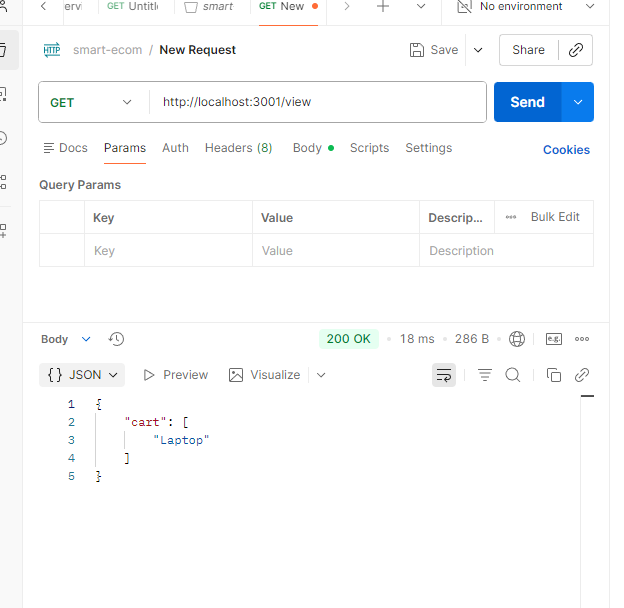
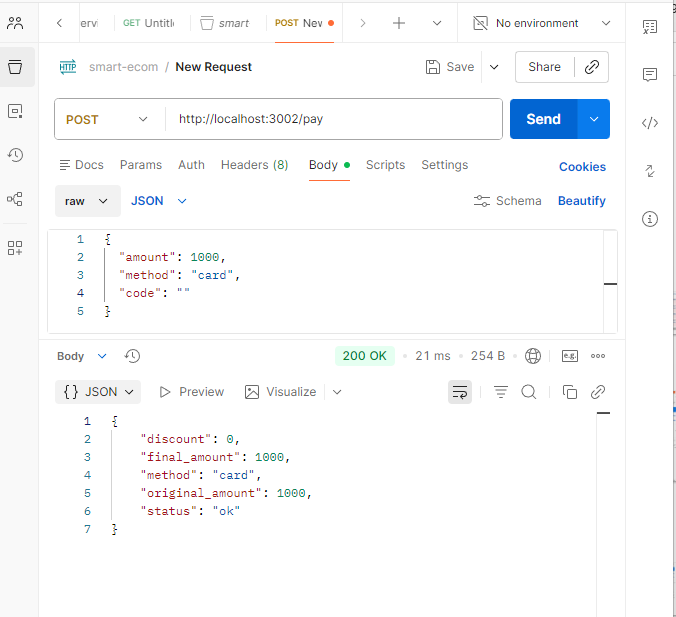
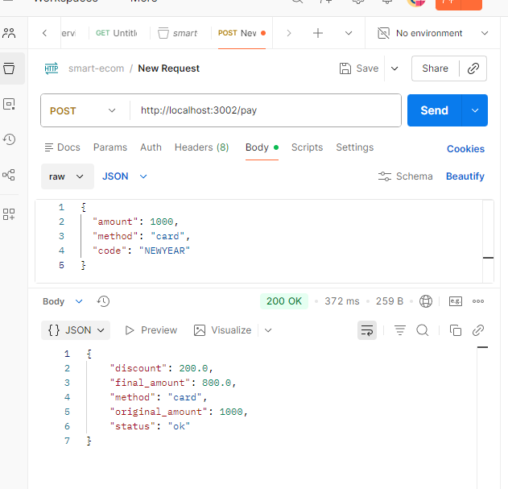
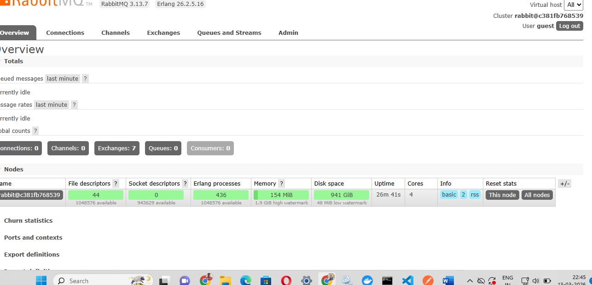
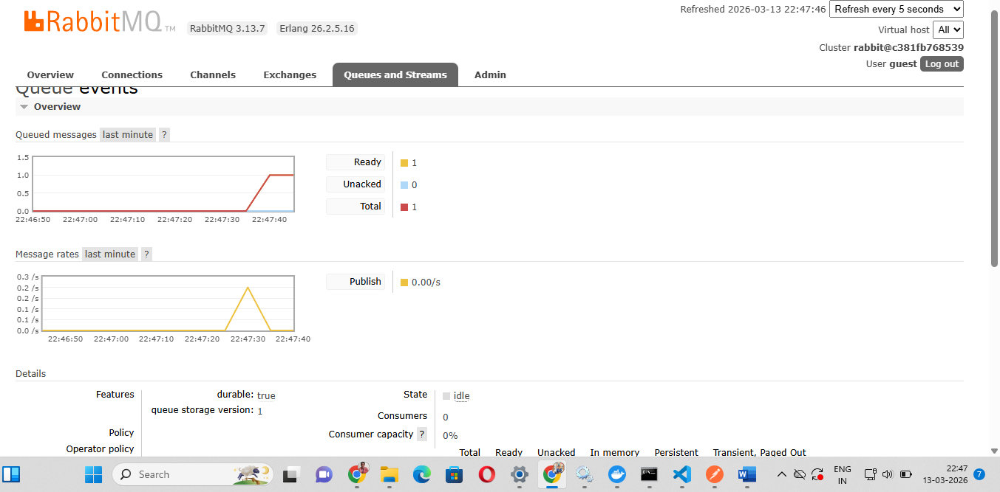

# Smart E-commerce Microservices

[](https://github.com/RiyaDominic/smart-ecom)

## Project Overview

This project demonstrates a complete end-to-end e-commerce checkout pipeline using independent microservices. It simulates a real-world workflow similar to Amazon or Flipkart, utilizing REST APIs, asynchronous messaging with RabbitMQ, persistent storage with MySQL, and serverless functions for discount calculations. The system operates without a user interface, focusing on backend microservices communication.

---

## Architecture

The architecture follows a microservices pattern with the following flow:

```
[Cart Service] → [Discount Function] → [Payment Service] → [RabbitMQ] → [Inventory Service] → [MySQL]
     ↓
[gRPC Cart Service] (Alternative gRPC interface)
```

- **Cart Service (Node.js/Express)**: Manages shopping cart operations (add, view, clear items).
- **Discount Function (Serverless/AWS Lambda)**: Calculates discount rates based on promo codes.
- **Payment Service (Python/Flask)**: Processes payments, applies discounts, and publishes payment events.
- **Inventory Service (Java/Spring Boot)**: Manages product inventory, consumes payment events to update stock.
- **gRPC Cart Service (Node.js/gRPC)**: Provides an alternative gRPC interface for cart operations.
- **RabbitMQ**: Message broker for asynchronous communication between payment and inventory services.
- **MySQL**: Database for persistent inventory storage.

---

## Services & Technologies

| Service | Technology | Port | Description |
|---|---|---|---|
| Cart Service | Node.js / Express | 3001 | REST API for cart management |
| Payment Service | Python / Flask | 3002 | Payment processing with discount application |
| Inventory Service | Java / Spring Boot | 3003 | Inventory management with JPA and RabbitMQ consumer |
| Discount Function | Serverless (Node.js) | 3000 (offline) | Serverless function for discount calculation |
| gRPC Cart Service | Node.js / gRPC | 50051 | gRPC interface for cart operations |
| RabbitMQ | Docker Image | 5672 / 15672 | Message broker |
| MySQL | Docker Image | 3307 | Database |

---

## Prerequisites

- Docker and Docker Compose
- Node.js (for cart service and discount function)
- Python 3 (for payment service)
- Java 11+ and Maven (for inventory service)
- Serverless Framework (for discount function)

---

## Installation & Setup

1. **Clone the repository:**
   ```bash
   git clone https://github.com/RiyaDominic/smart-ecom.git
   cd smart-ecom
   ```

2. **Install dependencies for each service:**

   - Cart Service:
     ```bash
     cd cart-service
     npm install
     cd ..
     ```

   - Payment Service:
     ```bash
     cd payment-service
     pip install flask pika
     cd ..
     ```

   - Inventory Service:
     ```bash
     cd inventory-service
     mvn clean install
     cd ..
     ```

   - Discount Function:
     ```bash
     npm install -g serverless
     cd discount-function
     npm install
     cd ..
     ```

---

## Running the Application

### Using Docker Compose (Recommended)

1. Navigate to the deploy directory:
   ```bash
   cd deploy
   ```

2. Start all services:
   ```bash
   docker-compose up --build
   ```

   This will start all microservices, RabbitMQ, and MySQL.

### Running Individually

1. **Start infrastructure:**
   ```bash
   cd deploy
   docker-compose up rabbitmq mysql
   ```

2. **Start Discount Function (Serverless Offline):**
   ```bash
   cd discount-function
   serverless offline start
   ```

3. **Start Cart Service:**
   ```bash
   cd cart-service
   node index.js
   ```

4. **Start Payment Service:**
   ```bash
   cd payment-service
   python app.py
   ```

5. **Start Inventory Service:**
   ```bash
   cd inventory-service
   mvn spring-boot:run
   ```

6. **Start gRPC Cart Service (optional):**
   ```bash
   cd grpc-cart
   node server.js
   ```

---

## API Endpoints

### Cart Service (REST)
- `POST /add` - Add item to cart
  - Body: `{ "item": "Laptop" }`
- `GET /view` - View cart items
- `DELETE /clear` - Clear cart

### Payment Service
- `POST /pay` - Process payment
  - Body: `{ "amount": 100, "method": "card", "code": "NEWYEAR" }`

### Discount Function
- `POST /apply-discount` - Get discount rate
  - Body: `{ "code": "NEWYEAR" }`

### Inventory Service
- `POST /inventory/update` - Update inventory
  - Body: `{ "Laptop": 50 }`
- `GET /inventory/view` - View all inventory

### gRPC Cart Service
- `ViewCart` - View cart items via gRPC

---

## Testing the Checkout Flow

### Step 1: Set up Inventory
```bash
curl -X POST http://localhost:3003/inventory/update \
  -H "Content-Type: application/json" \
  -d '{"Laptop": 50}'
```

### Step 2: Add Items to Cart
```bash
curl -X POST http://localhost:3001/add \
  -H "Content-Type: application/json" \
  -d '{"item": "Laptop"}'
```

### Step 3: View Cart
```bash
curl http://localhost:3001/view
```

### Step 4: Apply Discount
```bash
curl -X POST http://localhost:3000/apply-discount \
  -H "Content-Type: application/json" \
  -d '{"code": "NEWYEAR"}'
```

### Step 5: Process Payment
```bash
curl -X POST http://localhost:3002/pay \
  -H "Content-Type: application/json" \
  -d '{"amount": 1000, "method": "card", "code": "NEWYEAR"}'
```

### Step 6: Check Inventory Update
After payment, the inventory should be updated automatically via RabbitMQ.

```bash
curl http://localhost:3003/inventory/view
```

---

## Deployment

### Kubernetes
Use the provided Kubernetes manifest:
```bash
kubectl apply -f deploy/k8s-cart.yaml
```

### Serverless Deployment
For the discount function:
```bash
cd discount-function
serverless deploy
```

---

## Technologies Used

- **Node.js**: Cart service and gRPC service
- **Python/Flask**: Payment service
- **Java/Spring Boot**: Inventory service
- **Serverless Framework**: Discount function
- **RabbitMQ**: Message queuing
- **MySQL**: Database
- **Docker**: Containerization
- **gRPC**: Alternative communication protocol

---

## Contributing

1. Fork the repository
2. Create a feature branch
3. Commit your changes
4. Push to the branch
5. Open a Pull Request

---

## License

This project is licensed under the ISC License.

---

## Support

For questions or issues, please open an issue in the repository.

### GET — View Cart Contents
```
GET http://localhost:3001/view
```


---

## Step 5 — Discount Function (Serverless Offline)

```bash
cd discount-function
npm install
serverless offline --httpPort 3000 --lambdaPort 3004
```

### With NEWYEAR Code (20% discount)
```
POST http://localhost:3000/dev/apply-discount
Body: { "code": "NEWYEAR" }
```


### Without Discount Code
```
POST http://localhost:3000/dev/apply-discount
Body: { "code": "BLAH" }
```


---

## Step 6 — Payment Service

### Payment WITH Discount (NEWYEAR — 20% off)
```
POST http://localhost:3002/pay
Body: { "amount": 1000, "method": "card", "code": "NEWYEAR" }
```
> Final amount = 1000 - 200 = 800



### Payment WITHOUT Discount
```
POST http://localhost:3002/pay
Body: { "amount": 1000, "method": "card", "code": "" }
```


---

## Step 7 — RabbitMQ Messaging

### Publish Event (payment_processed)
```bash
docker exec -it deploy-payment-1 python -c "import pika; conn = pika.BlockingConnection(pika.ConnectionParameters('rabbitmq')); ch = conn.channel(); ch.queue_declare(queue='events', durable=True); ch.basic_publish(exchange='', routing_key='events', body='payment_processed'); conn.close(); print('Event published successfully')"
```


### RabbitMQ Dashboard — Queue with Message
> Browser: http://localhost:15672 (guest/guest) → Queues and Streams tab



### Consume Event
```bash
python -c "import pika; conn = pika.BlockingConnection(pika.ConnectionParameters('localhost')); ch = conn.channel(); ch.queue_declare(queue='events', durable=True); ch.basic_consume(queue='events', on_message_callback=lambda ch,m,p,b: [print('Event:', b.decode()), ch.stop_consuming()], auto_ack=True); print('Waiting for events...'); ch.start_consuming()"
```


---

##  Full Checkout Flow Summary

| Step | Action | Endpoint |
|---|---|---|
| 1 | Add Laptop to inventory (qty: 50) | `POST /inventory/update` |
| 2 | Add Laptop to cart | `POST /add` |
| 3 | View cart | `GET /view` |
| 4 | Apply NEWYEAR discount → 20% off | `POST /dev/apply-discount` |
| 5 | Pay discounted amount (₹800) | `POST /pay` |
| 6 | Publish payment event to RabbitMQ | python command |
| 7 | Update inventory after purchase (qty: 45) | `POST /inventory/update` |
| 8 | Verify stock in MySQL | `GET /inventory/view` |

---

## Key Concepts Demonstrated

- **Synchronous REST APIs** — Cart, Payment, Inventory via HTTP
- **Asynchronous Messaging** — RabbitMQ publishes `payment_processed` event
- **Serverless Computing** — Discount function runs offline via Serverless Framework
- **Persistent Storage** — Inventory data persists in MySQL via Spring Boot JPA
- **Containerization** — All services run via Docker Compose
