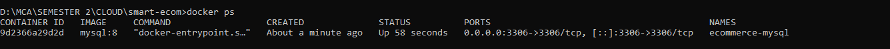
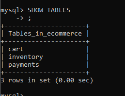
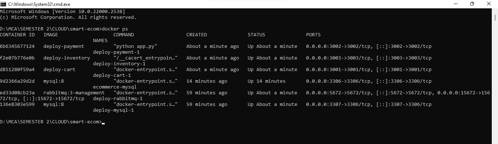
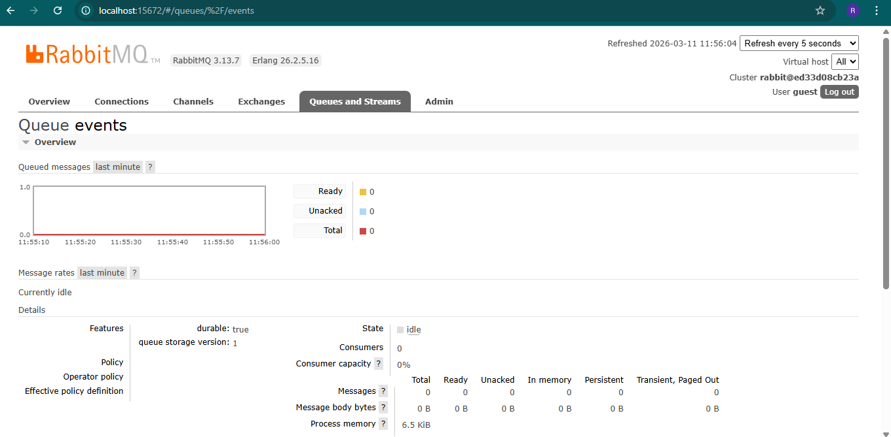
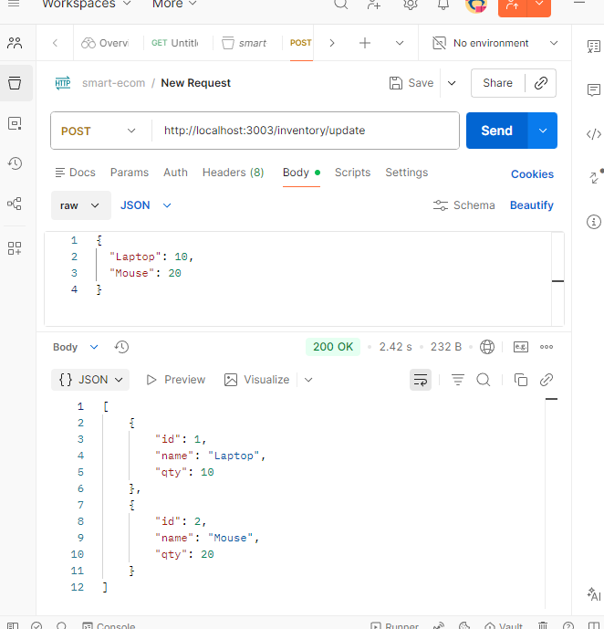
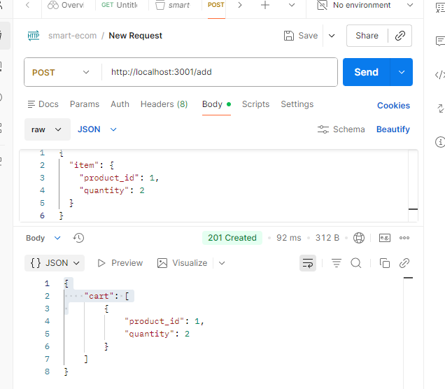
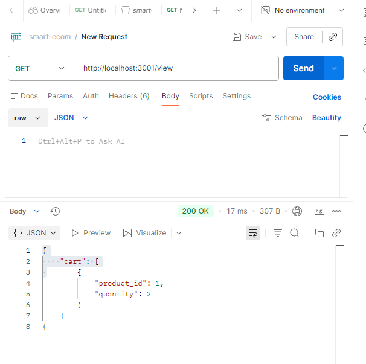
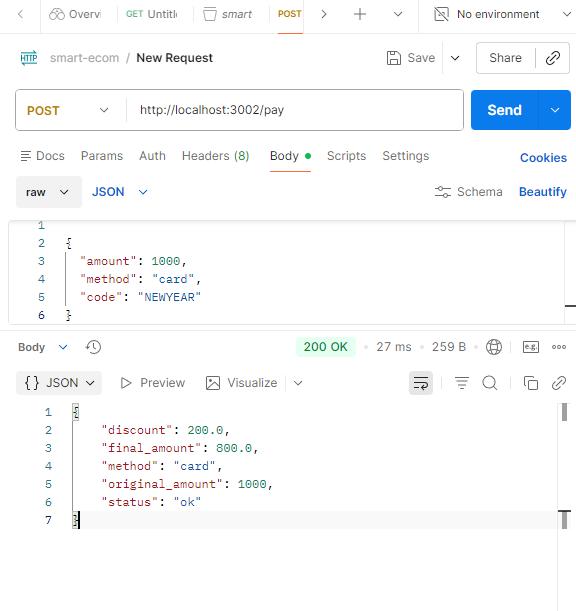

# Smart Ecom Project




This repository contains several microservices and components for the `smart-ecom` application.

## Services

- **Payment Service**: A Flask-based service handling payment processing with a simple discount code feature. Detailed documentation is included below and also available in `payment-service/README.md`.
- **Cart Service**: Node.js service for shopping cart operations (`cart-service/`).
- **Discount Function**: Serverless function (in `discount-function/`).
- **gRPC Examples**: Demonstrations in `grpc_cart/`, `grpc-cart/`, and `grpctest/`.
- **Inventory Service**: Java-based service under `inventory-service/`.

## Root README

The root README gives an overview of the project layout and references specific service READMEs.

## Getting Started

Choose a component and follow its individual documentation to run or build it.

---

### Running the Payment Service (full details inline)



The payment service provides a `/pay` endpoint and applies a discount code when appropriate.

#### Features

- Exposes a single `/pay` endpoint that accepts a JSON payload.
- Applies a discount when the `code` field is set to `NEWYEAR` (20% off).
- Returns payment details including original amount, discount applied, and final amount.

#### API

**POST /pay**

Request Body (JSON):

```json
{
  "amount": 100.0,
  "method": "card",
  "code": "NEWYEAR"  // optional discount code
}
```

- `amount` (number): The total amount to be charged. Defaults to `0`.
- `method` (string): Payment method (e.g., `card`, `paypal`). Defaults to `card`.
- `code` (string): Optional discount code. If set to `NEWYEAR`, a 20% discount is applied.

Response (JSON):

```json
{
  "status": "ok",
  "method": "card",
  "original_amount": 100.0,
  "discount": 20.0,
  "final_amount": 80.0
}
```



#### Running Locally

1. Make sure you have Python 3.7+ and `pip` installed.
2. Create a virtual environment and activate it:

   ```bash
   python -m venv venv
   source venv/bin/activate    # on Windows: venv\Scripts\activate
   ```

3. Install dependencies:

   ```bash
   pip install flask
   ```

4. Start the service:

   ```bash
   python app.py
   ```

The service will listen on `http://0.0.0.0:3002`.



#### Docker

A `Dockerfile` is provided to build a container image.

```dockerfile
FROM python:3.11-slim
WORKDIR /app
COPY app.py ./
RUN pip install flask
EXPOSE 3002
CMD ["python", "app.py"]
```

Build and run the image:

```bash
docker build -t payment-service .
docker run -p 3002:3002 payment-service
```

> **Note:** This service is intentionally minimal for demonstration purposes. Extend it with real payment gateway integration and validation as needed.

---

### Cart Service



A lightweight Express.js microservice managing a shopping cart in memory.

- **Endpoints**:
  - `POST /add` – Add an item (JSON body `{ "item": ... }`).
  - `GET /view` – Retrieve the current cart contents.
  - `DELETE /clear` – Empty the cart.

Run it with Node.js:

```bash
cd cart-service
npm install
node index.js
```

The service listens on port **3001** by default.

---

### Discount Function


Serverless JavaScript function that calculates a discount percentage based on a promo code.

- Expects a JSON request with a `code` field.
- Returns `{ "discount": 0.2 }` for `NEWYEAR`, otherwise `{ "discount": 0 }`.

Deploy using the `serverless.yml` configuration in the `discount-function` folder (e.g. `serverless deploy`).

---

### gRPC Examples



Three folders demonstrate gRPC usage:

- `grpc-cart/` – Node.js server (`server.js`) with `cart.proto` and a Python client (`client.py`).
- `grpc_cart/` – Generated Python modules (`*_pb2.py`, `*_pb2_grpc.py`) for the cart service.
- `grpctest/` – A Python virtual environment containing gRPC tooling and dependencies for experimentation.

Use `protoc` or `grpc_tools` to regenerate bindings if you modify `cart.proto`.

---

### Inventory Service



Java Maven project providing inventory management logic.

```bash
cd inventory-service
mvn package
```

Artifact produced: `target/demo-0.0.1-SNAPSHOT.jar`. A Dockerfile is available for container builds.

---

### Deployment



Configuration for local and Kubernetes deployments lives in the `deploy/` directory:

- `docker-compose.yml` – orchestrate multiple services locally.
- `k8s-cart.yaml` – Kubernetes manifest for the cart service.
- `nginx.conf` – example reverse-proxy setup.
